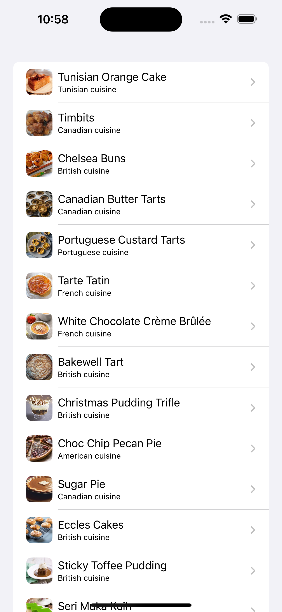
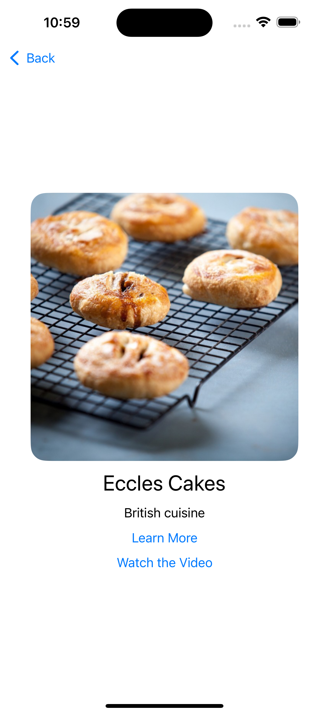
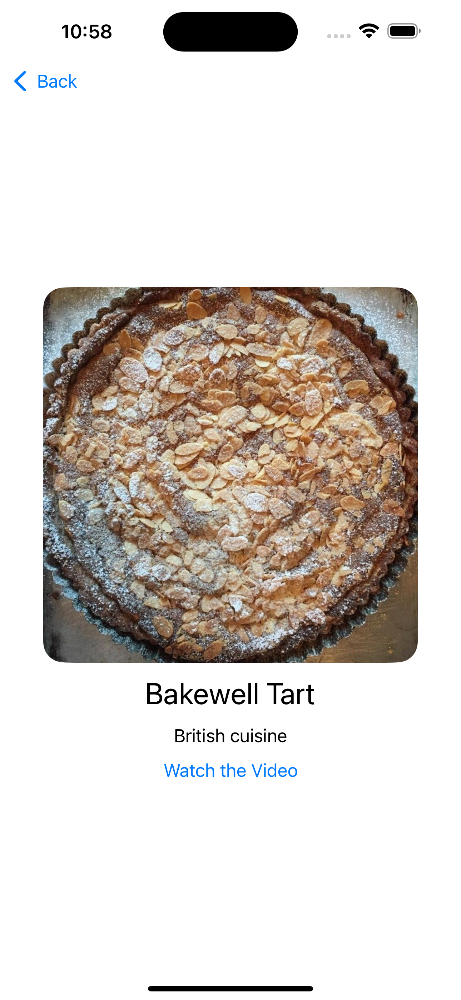

### Summary: Include screen shots or a video of your app highlighting its features
This is a recipes app made as part of an interviewing process. It will retrieve the recipes from an endpoint and display their releveant information.
The expected JSON is as follows:
```
{
  "recipes": [
    {
      "cuisine": "Malaysian",
      "name": "Apam Balik",
      "photo_url_large": "https://d3jbb8n5wk0qxi.cloudfront.net/photos/b9ab0071-b281-4bee-b361-ec340d405320/large.jpg",
      "photo_url_small": "https://d3jbb8n5wk0qxi.cloudfront.net/photos/b9ab0071-b281-4bee-b361-ec340d405320/small.jpg",
      "source_url": "https://www.nyonyacooking.com/recipes/apam-balik~SJ5WuvsDf9WQ",
      "uuid": "0c6ca6e7-e32a-4053-b824-1dbf749910d8",
      "youtube_url": "https://www.youtube.com/watch?v=6R8ffRRJcrg"
    },
    {...
```

Screenshots





### Focus Areas: What specific areas of the project did you prioritize? Why did you choose to focus on these areas?
In particular, I found it to be a good use of time to focus on the caching of data, as that seemed to be particularly emphasized in the prompts.
This also allowed me to focus on the idea of caching images, which AsyncImage doesn't (currently) seem to do.

### Time Spent: Approximately how long did you spend working on this project? How did you allocate your time?
I did not track my exact time for this app but I would expect it to be around 6 total hours, split up over several different instances of working.
The first thing I did was to create unit tests for making sure I could properly decode the json into models. From there, creating the interface and caching became the priority.
Ultimately I ended up not spending a lot of time on polishing the UI.

### Trade-offs and Decisions: Did you make any significant trade-offs in your approach?
I think a few pieces of this application could certainly be refactored a bit to be more reusable, but as this was an MVP-style approach I didn't pursue that at this time. I believe the UI could also be cleaned up quite a bit and there is probably some better offline/error handling that could be done.
I also chose to support iOS 17+. I know Fetch currently supports iOS 16 but I was treating this as a new project, since it was. I believe supporting the previous version and the current version allows for proper coverage, especially given iOS is receiving a new update very soon.

### Weakest Part of the Project: What do you think is the weakest part of your project?
I think the UI is actually the weakest point of the app as there is very little going on here. I think there could be quite a bit more flair added given some extra time and assets.

### Additional Information: Is there anything else we should know? Feel free to share any insights or constraints you encountered.
If I were to spend some more time on this project for myself I believe I would do the following things:
1. Install SwiftLint and clean up any warnings or issues that are seen with that.
2. Add touchups to the UI, particularly on the detail page.
3. Make the links inside of the detail page be handled differently, perhaps. Should they stay within the app? Perhaps!
4. Add more tests, particularly around spots in which the data connections can fail to deliver proper information.